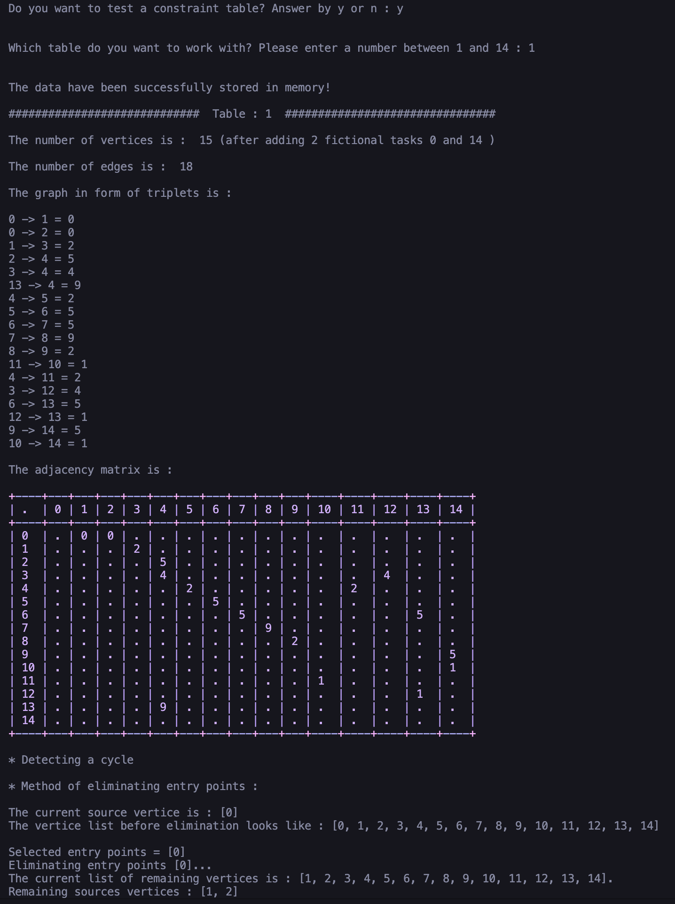
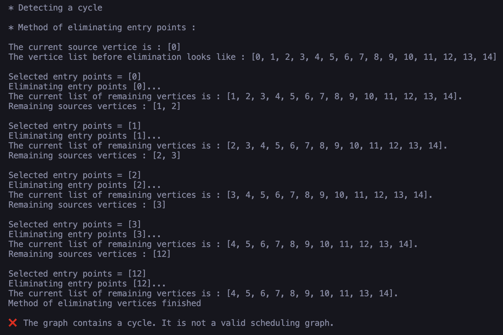

# 📅 Scheduling Graph

**Scheduling Graph** is a Python tool for analyzing project scheduling constraints through graph theory.  
It computes scheduling ranks, detects cycles, and identifies the critical path using the **Critical Path Method (CPM)**.

---

## 🖼️ Preview




---

## ✨ Features

- Read and parse constraint tables
- Construct the scheduling graph from input
- Detect cycles and negative arcs
- Compute ranks of vertices
- Calculate earliest and latest dates, and float margins
- Identify the critical path using CPM

---

## 🛠 Technologies Used

- 
- 

---

## 📦 Getting Started

To run the project locally:

```bash
git clone https://github.com/chealeanpenhchakrith/Graph-Theory-Project.git
cd Graph-Theory-Project
python3 -m venv env
source env/bin/activate
pip install prettytable
python main.py
